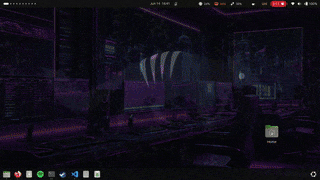

# Wechsel-Wallpaper

A plugin for [Wechsel](https://github.com/JustSomeRandomUsername/wechsel/)
that lets you define unique wallpapers for each project.



## Installation

Download the release and put it into any folder in your `PATH`.
Afterwards run:
```bash
wechsel-wallpaper init
```
Init is required to link the plugin with Wechsel.

### **Important**
wechsel-wallpaper will use the currently active wallpaper as the default wallpaper for all projects and will revert to it on uninstall.

## Usage

All commands have the project name as an optional argument. If no project is specified the current active wechsel project is used.

To set a wallpaper for a project, run:
```bash
wechsel-wallpaper install <?project> --dark <wallpaper> --light <wallpaper>
```
`--dark` is the path to the wallpaper for dark mode and `--light` is the path to the wallpaper for light mode. You do not need to specify both wallpapers, if you only want to set one. The other one will stay at the systems default.

To remove a wallpaper from a project, run:
```bash
wechsel-wallpaper remove <?project>
```
It will delete both the dark and light wallpaper for the project.

To Save the projects wallpapers before deleting them, run:
```bash
wechsel-wallpaper save <?project> <path>
```
Both wallpapers will be copied to the specified path.

To completly remove the plugin from Wechsel, run:
```bash
wechsel-wallpaper de-init
```
and delete the binary from whereever you put it.